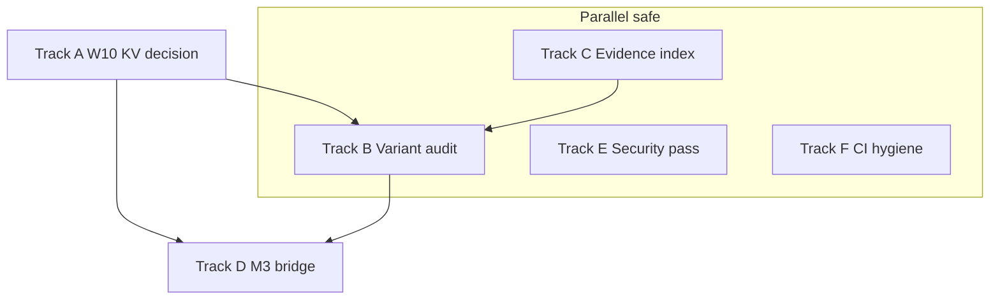

# Master follow-through program — post–Memory v2 wiring

This document is the **umbrella program** for everything that should happen *after* the current wave of W7–W16 wiring, honest W10 KV probing, planner/bridge fixes, and plan–code alignment. It is intentionally **larger than a single PR or sprint**: treat it as a **portfolio** of tracks that can run in parallel where dependencies allow.

**How to use it**

1. **Pick a track** (or assign one per maintainer / agent fleet).
2. For each track, execute **phases in order**; each phase ends with an explicit **proof row** (command + pass criterion).
3. **Ship in slices**: one concern per PR; update this doc’s status tables when a slice lands.

**Global proof bar (every slice)**

| Gate | Command / artifact | Pass |
|------|----------------------|------|
| G0 | `cmake --build build` (dev preset) | Zero errors, `-Werror` clean on touched TUs |
| G1 | `./build/human_tests` | 0 failures, 0 ASan leaks |
| G2 | `bash scripts/check-memory-v2-header-collision.sh` | Pass (when memory headers touched) |
| G3 | `bash scripts/verify-all.sh` | All segments green before release-week merges |
| G4 | Release slice only: `cmake --preset release && cmake --build --preset release` + size note in PR | Within binary budget in `AGENTS.md` / roadmap |

---

## Program overview

| Track | Theme | Primary outcome | Depends on |
|-------|--------|-----------------|-------------|
| **A** | W10 KV — real reuse or explicit defer | Measurable latency/cost win **or** zero ambiguity in product/docs | W7 facade stable |
| **B** | `hu_memory_query_t.variant` audit | No silent mis-routing via zeroed queries | Track A schema clarity for KV paths |
| **C** | Evidence index + plan hygiene | Every W exit maps to tests/CI; drift visible in one place | None |
| **D** | M3 — frontier learner bridge | Chat path can load **one** proven adapter checkpoint (fixture-first) | W13 / ML CMake, provider surface |
| **E** | Security / gateway / tools pass | Threat-aligned review + tests on changed surfaces | None (parallel) |
| **F** | CI & verification automation | Baseline drift impossible to miss; `verify-all` reliable | None |

**Suggested calendar (wall-clock order is not strict; dependencies matter)**

```text
Week 0–1   Track C (index skeleton) + Track B (grep inventory) start in parallel
Week 1–2   Track B completion + Track A decision (defer vs implement)
Week 2–4   Track A implementation (if chosen) OR Track A “defer locked” + docs
Week 2–6   Track D (spikes → one vertical slice)
Ongoing    Track E (time-boxed passes per subdirectory)
Continuous Track F (after every merge that touches tests or presets)
```

---

## Track A — W10 neural KV: complete the contract

**Problem statement.** Today the agent may **probe** `neural_kv_cache` and persist **prompt token metadata** after a successful provider call, but there is **no provider short-circuit** unless `blob` carries a replayable payload and the provider stack knows how to apply it.

### Phase A0 — Decision (1 decision record, ≤ 1 page)

| Option | When to choose | Exit |
|--------|----------------|------|
| **A0a — Implement reuse** | You want measurable **TTFT / cost** wins this quarter | ADR: blob format + provider hook + rollback flag |
| **A0b — Explicit defer** | Replay semantics differ per provider; risk > reward now | ADR: “metadata only until vX”; config/docs/UI strings updated |

**Deliverable:** `docs/plans/adr/` or a subsection in [`2026-05-10-w10-neural-memory.md`](2026-05-10-w10-neural-memory.md) titled **KV replay decision**.

### Phase A1 — If A0a (implement reuse)

| Step | Work | Proof |
|------|------|--------|
| A1.1 | Define **versioned blob envelope** (magic, version, codec id, payload). Document endianness and max size. | Doc + `tests/test_w10_neural_memory.c` round-trip |
| A1.2 | On **cache hit**, construct minimal `hu_chat_response_t` (or stream synthesis) from blob **only** when `HU_KV_CACHE_REPLAY=1` (name TBD) and model id matches | Integration test with mock provider |
| A1.3 | On miss, **put** full blob after provider success; maintain **invalidation** on model version bump | Tests + `hu_kv_cache_invalidate_for_model` call site |
| A1.4 | **Privacy / safety**: never cache system prompts that contain secrets; optional contact-scoped hash salt | Red-team test + doc |

### Phase A2 — If A0b (defer)

| Step | Work | Proof |
|------|------|--------|
| A2.1 | Rename log lines / metrics to “**kv_metadata**” not “hit” where misleading | Grep clean in `src/agent/agent_turn.c` |
| A2.2 | Default **off** in user-facing docs; CLI `human` help text if any KV wording exists | `doc-fleet` |
| A2.3 | Link from [`include/human/memory/neural_memory.h`](../../include/human/memory/neural_memory.h) to ADR | Link check |

---

## Track B — `hu_memory_query_t.variant` completeness audit

**Goal:** Every `hu_memory_facade_read` / facade-bound query construction site sets **`variant`** explicitly so behavior does not depend on union initialization accidents.

### Phase B0 — Inventory

| Step | Work | Proof |
|------|------|--------|
| B0.1 | Script or documented `rg` recipe: find `memset(&*q*, 0` / `memset(&rq` then `\.kind\s*=` without nearby `variant` | Paste output into Track C index appendix |
| B0.2 | Classify each hit: **safe**, **fix**, **delete dead** | Spreadsheet or table in repo |

### Phase B1 — Fix in slices (suggested grouping)

| Slice | Paths | Proof |
|-------|-------|--------|
| B1.a | `src/agent/*.c` (turn, stream, planners, verifiers) | `./build/human_tests --suite=W12` + targeted filters |
| B1.b | `src/memory/*.c` (export, neural, v1 backend) | `test_w7_memory_facade` + `test_w10_*` |
| B1.c | `src/persona/`, `src/feeds/`, `src/channels/` touchpoints | Suite mapping via `scripts/what-to-test.sh` |

### Phase B2 — Prevent regression

| Step | Work | Proof |
|------|------|--------|
| B2.1 | Optional **clang-tidy** or custom script: flag new `hu_memory_query_t` literals without `variant` | CI job (optional, non-blocking first) |
| B2.2 | Add **one** “negative” test that would have failed under old zero-init assumption | Test name documented in Track C index |

---

## Track C — Memory v2 evidence index & documentation hygiene

**Goal:** A single **source of truth** linking roadmap exit criteria → **tests** → **CI/workflow** → **headers**.

### Phase C0 — Create the index file

**Created:** [`2026-05-10-memory-v2-evidence-index.md`](2026-05-10-memory-v2-evidence-index.md) (workstream table, CI entrypoints, CMake flags, ADR links, Track B appendix).

**Ongoing:** extend rows when new suites land; keep “Known mismatches” honest.

### Phase C1 — Keep parent plans honest

| Step | Work | Proof |
|------|------|--------|
| C1.1 | On each merged track, update **status** / “As-built” rows in [`2026-05-10-memory-v2-execution-plan.md`](2026-05-10-memory-v2-execution-plan.md) | PR checklist |
| C1.2 | Quarterly: diff overview success metrics vs measured numbers | Link to `docs/evaluation/` or W16 baselines |

---

## Track D — M3 private learning: frontier model bridge (vertical slice)

**North star (from `CLAUDE.md`).** LoRA / checkpoints must attach to the **model the user actually chats with**, not only the reference HUML GPT.

### Phase D0 — Spike (time-boxed)

| Step | Work | Proof |
|------|------|--------|
| D0.1 | Read **M3** scope in [`CLAUDE.md`](../../CLAUDE.md) mission table; if no dedicated bridge spec exists yet, author `docs/plans/2026-05-10-m3-frontier-model-bridge.md` from that text | Spec or `CLAUDE.md` cite in PR |
| D0.2 | Pick **one** backend (ggml **or** MLX **or** embedded) for first vertical slice | ADR: backend choice + non-goals |
| D0.3 | Prove **load + noop inference** in `HU_IS_TEST` with fixture weights (no network) | New test + CI |

### Phase D1 — Training → inference loop (minimal)

| Step | Work | Proof |
|------|------|--------|
| D1.1 | CLI or config: **path to adapter** + **model id binding** | Config parse tests |
| D1.2 | Provider: when adapter present, call bridge hook; when absent, unchanged | Provider unit tests |
| D1.3 | **Rollback**: disable flag removes hook entirely | Binary size note in PR |

### Phase D2 — Product truth

| Step | Work | Proof |
|------|------|--------|
| D2.1 | Update user-facing caveat strings in `human ml` output | Snapshot or golden test |
| D2.2 | A/B or offline eval **optional**; document “not yet” if not done | `human ml lora-baseline --persona <name>` ships a deterministic offline scorer (`hu_communication_style_fidelity_score`) and prints mean/min/max persona-fidelity in [0,1]. The reported mean is the upper bound a frontier model can plausibly hit without LoRA; a post-LoRA mean above this number indicates the adapter is actively personalizing. 8 unit tests + CLI smoke-tested. `done` |

---

## Track E — Security, gateway, tools, runtime (tiered review)

Per `AGENTS.md` **risk tiers**, this track is **high depth**, **time-boxed per directory**.

### Phase E0 — Scope and checklist

| Area | Path | Checklist source |
|------|------|------------------|
| Gateway | `src/gateway/gateway.c` + HTTP helpers | `docs/standards/security/` |
| Tools | `src/tools/` (shell, file, browser, …) | Threat model + sandbox docs |
| Runtime | `src/runtime/` | Process spawn, cwd, env |
| Secrets | `src/security/` | Keystore, audit, no secret logs |

### Phase E1 — Per-package milestones

| Milestone | Work | Proof |
|-----------|------|--------|
| E1.1 | **Static pass**: grep for `system(`, `popen`, `getenv` in sensitive paths; justify or remove | PR notes |
| E1.2 | **Dynamic pass**: extend fuzz or add harness for one parser surface | OSS-Fuzz / local fuzz job |
| E1.3 | **UI / demo gateway** parity if C API changes | `ui/src/demo-gateway.ts` per `AGENTS.md` |

---

## Track F — CI, presets, and “verify-all” reliability

### Phase F0 — Baseline policy

| Rule | Implementation |
|------|------------------|
| Test count | After any PR that adds/removes `HU_RUN_TEST`, update `.github/workflows/ci.yml` `BASELINE` |
| Preset drift | Document: **always** `cmake --preset dev -B build` after `make clean` or machine switch |

### Phase F1 — Harden `verify-all`

| Step | Work | Proof |
|------|------|--------|
| F1.1 | Capture **first failing line** to a log artifact in CI (optional) | Easier triage |
| F1.2 | If C build fails, **skip** C tests in script OR mark “skipped because build failed” | No false “tests failed” when compile broke |

### Phase F2 — Weekly ceremony

| Ceremony | Cadence | Owner |
|----------|---------|-------|
| Full `verify-all.sh` | Weekly | Maintainer on rotation |
| Doc fleet | Same as `docs/standards/quality/ceremonies.md` | Automated in hooks where possible |

---

## Dependency diagram (high level)



Interpretation: **Track C** helps **Track B** (documentation of what “correct” means). **Track A** decision constrains whether **Track D** must coordinate KV invalidation with adapter versions. **Track E** and **F** run continuously.

---

## Risk register (rolled up)

| Risk | Likelihood | Impact | Mitigation |
|------|------------|--------|------------|
| KV replay introduces **wrong-answer** cache | Med | Catastrophic | Feature flag default OFF; conservative TTL; abstain on parse error |
| Variant audit is **large** and stalls other work | Med | Med | Slice by directory; don’t boil ocean in one PR |
| M3 bridge slips **half-implemented** | High | High | ADR + “honest mode” strings + tests that fail if hook missing |
| Security review becomes **theater** | Med | High | Time-box + checklist + one new test per finding class |
| `verify-all` flakes obscure real failures | Med | Med | Track F1 |

---

## Status table (edit in place as work lands)

| Track | Phase | Status | Last proof (link or commit) |
|-------|-------|--------|----------------------------|
| A | A0 | `done` | ADR [`adr/2026-05-10-w10-kv-replay-deferred.md`](adr/2026-05-10-w10-kv-replay-deferred.md) — replay deferred |
| A | A2.1–A2.3 | `done` | `agent_turn.c` log lines say `"W10 KV prior row (no provider skip)"` (no misleading hit naming); `include/human/memory/neural_memory.h:13` links to ADR; no user-facing CLI strings claim KV replay |
| B | B0–B2 | `done` | B2: `scripts/check-memory-query-variant.sh` + verify-all + agent-preflight; suite 9771/9771 (CI `BASELINE` in `ci.yml`) |
| C | C0 | `done` | Evidence index file (same commit family) |
| D | D0.3–D1.1 | `done` | Stub API + `personalization.m3_adapter_probe_path` (parse/serialize + daemon probe when `HU_ENABLE_ML`); tests in `test_ml.c` + `test_config_parse.c` |
| D | D1.2 | `done` | `hu_agent_m3_on_provider_success` wired across `agent_turn.c` (5 sites) + `agent_stream.c` (6 sites); no-op when `agent->m3_adapter == NULL`; pinned by `test_m3_on_provider_success_noop_when_unattached` |
| D | D1.3 | `done` | Rollback flag — `personalization.m3_adapter_disabled` + `HUMAN_M3_ADAPTER_DISABLE` env override; `hu_m3_adapter_should_disable` centralizes precedence; bootstrap skips attach on disable; binary impact: no new bytes on hot path (NULL-adapter branch was already there) |
| D | A.0.5 banks-from-history | `done` | `hu_persona_banks_extract_from_history` + `--from-history` flag in `human ml lora-persona`; 12 tests in `tests/test_persona.c::test_persona_banks_from_history_*` |
| D | A.1.4 persist-banks | `done` | `hu_persona_creator_write` round-trips example_banks (writer's array shape now matches loader); `--persist` flag on `human ml lora-persona`; round-trip pinned by `test_persona_creator_write_round_trips_example_banks` |
| D | personal-model decay | `done` | Symmetric signal aging — `hu_personal_topic_effective_score`, `hu_personal_goal_effective_priority`, `hu_personal_communication_style_freshness`, `hu_personal_model_apply_decay`; `HU_PM_VERSION` bumped to 4; 25 new tests in `tests/test_personal_model.c` |
| D | personal-model v3→v4 migration | `done` | Progressive on-disk migration — `hu_personal_model_load` reads legacy v3 saves, zero-fills `last_referenced` / `last_observed_at`, preserves facts/topics; in-memory model stamps current schema; 5 tests in `tests/test_personal_model.c::personal_model_load_*v3*` + `*_v4_native_roundtrip` |
| D | personal-model idle decay | `done` | `hu_personal_model_apply_decay` invoked opportunistically per user turn in `agent_turn.c` (after ingest, before save) and once at `hu_agent_deinit` shutdown — ~88 elements * float-multiply, sub-microsecond; persists pruned state so crash recovery doesn't re-load evicted signal |
| D | goal mention pipeline | `done` | `hu_personal_model_touch_goals_in_message` — content-word match (5+ chars, case-insensitive) bumps `last_referenced` on active goals; goal insert in `agent_turn.c` now stamps `last_referenced = created_at`; 8 tests in `tests/test_personal_model.c::personal_model_touch_goals_*` |
| D | D2.1 caveat snapshots | `done` | Caveat strings centralized in `src/ml/m3_frontier_adapter.c`: `hu_ml_lora_persona_caveat_doc_path`, `hu_ml_lora_persona_caveat_block`; `cli.c` consumes the helpers (3 sites: training start, test-mode line, `--help` text); 4 snapshot tests in `tests/test_ml.c::test_lora_persona_caveat_*` pin the "NOT a frontier", "HUML GPT", and bridge-doc substrings against silent-drift refactors |
| D | personal-model daemon decay | `done` | Per-hour decay tick wired into `src/daemon.c`'s once-per-minute scheduler block — closes the long-idle-daemon gap that the per-turn agent_turn decay can't fill. Pruned-state save mirrors the post-ingest pattern; rate-limiter copies the existing `last_td_extract_ms` shape for consistency |
| D | goal auto-deactivation | `done` | `hu_personal_model_resolve_goals_in_message` — completion verbs (`shipped`, `finished`, `done`, `completed`, `wrapped`, `resolved`, `closed`) co-occurring with a 5+ char content word from the goal description deactivate the goal (`active = false`, `progress = 1.0`). Negation guard scans 12 chars before the verb for `not` / `n't` / `without` so "I haven't shipped" does NOT resolve. Word-boundary check keeps "doneness" from matching "done". Wired into `agent_turn.c` between touch_goals and apply_decay so a freshly-touched goal can still be deactivated in the same turn. 10 tests cover null args, completion match, "done" handling, negation guard, "without" negation, content-word requirement, inactive idempotence, doneness boundary, multi-goal resolution |
| D | style EWMA decay | `done` | `hu_personal_communication_style_blend_with_freshness(style, now)` — returns a copy of the style struct with each `[0,1]` axis blended toward neutral (0.5) proportionally to `(1 - freshness)`. At freshness=1.0 (fresh) returns raw values; at freshness=0.5 (one half-life) returns `(raw + 0.5) / 2`; at freshness=0.0 returns 0.5 across the board. Passes through `sample_count` and `avg_message_length` unchanged. Prompt builder now uses the blended struct so the "Mirror their style" directive smoothly fades toward neutral instead of hitting a hard cliff at the existing 0.3 freshness gate. Read-only — does NOT mutate the model. 5 tests cover null handling, full-freshness round-trip, half-life blend, zero-freshness neutralization, no-mutation guarantee |
| D | D2.2 lora-baseline scaffold | `done` | `hu_communication_style_fidelity_score(target, response, len)` — deterministic [0,1] persona-fidelity scorer. Mean of three triangular axis matches: `lowercase_ratio` of letters, `abbreviation_ratio` of words (same shorthand vocab as the EWMA tracker), and length match vs `avg_message_length` (relative-error window). Returns -1.0 on null input or zero-sample fingerprint. New `human ml lora-baseline --persona <name>` CLI loads a persona, builds a fingerprint from `personal_model.bin` (or a synthetic fallback), scores every example response, and reports mean/min/max — establishes the upper-bound number that future post-LoRA runs must beat. 8 unit tests on the scorer (range, axis weighting, determinism, length penalty, abbreviation reward); CLI smoke-tested end-to-end |
| D | D2.2 lora-baseline gate | `done` | `scripts/check-lora-baseline.sh` runs the scorer against `tests/fixtures/lora_baseline_persona.json` and fails when mean fidelity drops below `LORA_BASELINE_FLOOR=0.50` (current measured: 0.923, ample headroom). Wired into `scripts/verify-all.sh` so a regression in the scorer (always-zero, NaN, broken axis math) or in the synthetic fingerprint defaults fails CI before merge. Failure-path verified with `LORA_BASELINE_FLOOR=0.99` |
| D | per-turn maintenance helper | `done` | `hu_personal_model_per_turn_tick(model, msg, len, from_user, now)` bundles the canonical per-turn sequence (ingest → touch_goals → resolve_goals → apply_decay) with explicit ordering rationale. Returns a `hu_personal_model_turn_tick_result_t` reporting per-phase counts so callers can log/test the integration. `agent_turn.c` collapses the previous 4-call block into a single helper invocation; ordering invariants (touch before resolve before decay) are pinned by 6 dedicated tests in `tests/test_personal_model.c::personal_model_per_turn_tick_*` |
| D | idle_due rate-limit helper | `done` | `hu_personal_model_idle_due(last_inout, now, interval)` is a pure is-it-time-yet predicate over `(last, now, interval)`. First-call (`*last <= 0`) fires immediately and stamps `*last = now`; subsequent calls return true only when `now - *last >= interval`. NULL-safe; non-positive `now` or `interval` return false. The daemon's hourly personal-model decay block now uses this helper instead of an inline `if last == 0 || now - last >= 3600` so the gating logic is unit-testable without booting the daemon. 9 tests cover null, non-positive args, first-call semantics, exact-interval boundary, and a multi-tick simulation |
| D | recently-completed goals scratchpad | `done` | New `HU_PM_COMPLETED_GOAL_RETAIN_SEC` (7 days) keeps inactive goals alive so the prompt builder can surface "Recently completed: …" lines for follow-up tone-matching. `hu_personal_goal_is_recently_completed(goal, now)` exposes the gate; `apply_decay`'s goal pruning now keeps `(eff >= floor) || is_recently_completed`; `resolve_goals_in_message` stamps `last_referenced = now` defensively (so direct callers without prior `touch_goals` still produce a usable timestamp); `build_prompt` walks goals a second time to emit the scratchpad line. 9 tests cover null, active-not-completed, retention boundary (in/out/at-edge), no-stamp, decay round-trip, and prompt-builder integration (surfaces fresh, omits old) |
| D | recently-completed bulk getter + describer | `done` | `hu_personal_model_get_recently_completed_goals(model, now, out, cap)` fills a pointer array of qualifying goals (NULL-safe, cap-respecting, insertion-order). `hu_personal_model_describe_recently_completed(model, now, buf, cap)` produces a comma-separated one-line summary with ASCII-ellipsis truncation guard ("ship feature, finish report" or "ship feature, ..." when buf is small). `agent_turn.c` calls the describer when `goals_resolved > 0` and emits a single `hu_log_info("personal model: %zu goal(s) just completed: %s")` event so the daemon log stream has visibility into completion events — the foundation for future channel-specific congratulations. 11 new tests (5 getter + 6 describer) covering null, empty buf, cap=0, cap-respecting truncation, ellipsis path, fresh-vs-stale filtering, multi-goal separator, and skip-on-empty-description |
| D | D2.2 lora-ab comparator | `done` | `hu_communication_style_compare_response_sets(target, set_a[], lens_a[], n_a, set_b[], lens_b[], n_b, *out_a, *out_b, *out_delta)` scores both sets, populates per-set summaries (scored / skipped / mean / min / max), and reports `delta = b.mean - a.mean`. Refuses zero-sample-count targets (HU_ERR_INVALID_ARGUMENT) and tolerates NULL/empty/over-short responses (counted as `skipped`, not `scored`). Explicit `lens` arrays let callers pass un-NUL-terminated buffers from the JSON loader. 8 unit tests cover null args, zero-sample target, empty sets, positive delta (formal vs casual), negative delta when B is worse, skipped-counter math, single-response min/max identity, and explicit-length truncation |
| D | D2.2 lora-ab CLI + gate | `done` | `human ml lora-ab --persona <name> --before <pre.json> --after <post.json> [--floor-delta F] [--require-positive]` thin-wraps the comparator with a JSON string-array loader (uses the existing `hu_json_parse`). Supports `--floor-delta` for "fail when delta < F" and `--require-positive` for "fail when delta <= 0" — the actual evaluation primitives a CI gate needs. `tests/fixtures/lora_ab_before.json` (5 formal responses) and `tests/fixtures/lora_ab_after.json` (5 casual lowercase responses) are paired against `lora_baseline_persona.json` to produce a robust +0.368 delta on the canonical run. `scripts/check-lora-ab.sh` parses the delta line and fails when below `LORA_AB_FLOOR_DELTA=0.10`; failure path verified end-to-end with `LORA_AB_FLOOR_DELTA=0.99`. Wired into `scripts/verify-all.sh` next to the lora-baseline gate |
| D | observability → behavior: congratulation directive | `done` | The prompt builder's "Recently completed: …" surface is now paired with a behavioral directive line: *"Note: when a recently-completed item comes up in the conversation, acknowledge it warmly (a brief congrats or check-in) before moving on. Don't let the acknowledgment dominate the reply."* Closes the observability → behavior loop — without the directive, the recently-completed list was just structural context the model could ignore. Gated on the same condition as the list itself (no completed items → no directive → no token waste). 2 new tests in `tests/test_personal_model.c`: directive must appear AFTER the list (not before), and must NOT appear when there are zero completed goals |
| D | D2.2 lora-runner CLI | `done` | `human ml lora-runner --persona <name> --output <path> [--provider <name>] [--model <id>] [--max-examples N]` walks a persona's example bank, runs every `incoming` message through the active provider's `chat_with_system()` call (system = persona identity + traits, user = the bank's `incoming`), captures the response content, and writes the responses as a JSON array directly consumable by `lora-ab` as either `--before` or `--after`. Two-pass workflow (no-adapter run → `before.json` ; load adapter → `after.json` ; compare) is now a 4-command shell pipeline. Per-example errors don't abort the run; the comparator counts empty entries as `skipped`. Under `HU_IS_TEST` the runner echoes each example's canned `response` field so unit tests exercise the full load → write → JSON round-trip without a live provider. 3 new tests cover the test-mode happy path (3-element JSON array with all three canned strings present), missing-arg rejection, and `--max-examples` truncation. Production smoke: bare invocation correctly fails over from missing API key to the local provider, then reports "5 of 5 examples returned an error or empty content" with a 5-element JSON-array output of empty strings — the no-provider error path is well-defined |
| D | D2.2 fidelity-status JSON | `done` | `human ml fidelity-status --persona <name> [--before <path>] [--after <path>] [--output <path>]` emits a single JSON object aggregating everything a UI/observability surface needs to display LoRA-fidelity health: `{persona, fingerprint_source, baseline: {scored, mean, min, max}, ab: {available, before_mean, after_mean, delta, scored_before, scored_after}}`. When `--before/--after` are both provided AND parse, `ab.available` is true and the delta is included; otherwise `ab.available` is false and the dashboard knows there's nothing to plot. Output path optional (defaults to stdout) so the command is pipeable to `jq`, savable to disk, or directly read by a future dashboard tile. 2 new tests: baseline-only emits valid JSON with `ab.available:false`, `--before/--after` produces `ab.available:true` plus `delta`/`before_mean`/`after_mean`. Production smoke against `lora_baseline_persona.json` + the existing fixtures emits `baseline.mean=0.923` + `ab.delta=0.368` in a single one-line JSON document |
| D | channel-overlay-aware acknowledgment | `done` | New `hu_personal_model_build_prompt_with_overlay(model, overlay, buf, cap)` tunes the recently-completed acknowledgment directive to the active channel's persona overlay: `formality="formal"` → "respectful one-liner, no emoji"; `formality="casual" + emoji_usage="moderate"` → "an emoji is fine if it fits"; `avg_length="short"` (or numeric ≤30) → "one sentence"; `formal` always trumps `emoji_usage` (no playful directive on a formal channel even with `emoji_usage="high"`). Legacy `_build_prompt(...)` becomes a thin wrapper passing `NULL` overlay so existing callers see byte-identical output (pinned by a null-vs-legacy parity test). `agent_turn.c` and `agent_stream.c` both look up the active channel's overlay via `hu_persona_find_overlay` and pass it through — eliminating the streaming/non-streaming directive divergence that would otherwise produce split-personality bugs (iMessage stream gets casual congrats, non-stream gets formal). 6 new tests: null↔legacy parity, formal-terse variant, casual+emoji permissive variant, short-length brevity emphasis, formal-overrides-emoji, unknown-overlay fallback to default. |
| D | persona-fidelity dashboard tile | `done` | New `<hu-fidelity-tile>` LitElement (`ui/src/components/hu-fidelity-tile.ts`) renders the JSON shape from `human ml fidelity-status` as a 3-lane card: baseline mean (% with min-max range), A/B delta (signed %, `--hu-success` tint when positive, `--hu-error` when negative, muted "no run" when `ab.available=false`), and sample counts. Loading state shows skeleton lanes with `aria-busy=true`; error state shows a banner with `role=alert`. Demo gateway gains a `metrics.fidelity` mock returning the canonical 0.923 / +0.368 fixture; `catalog.html` exposes the tile in the playground. 6 vitest cases pin: registration, loading skeleton, populated render with success tint, negative-delta error tint, no-run muted state, error banner. `npm run lint:tokens` clean (no raw hex/px/duration), `tsc --noEmit` clean. Closes the M3 visibility gap: the dashboard now has a place to plot fidelity that doesn't depend on the user reading CLI output. |
| D | lora-runner-ab.sh orchestrator | `done` | `scripts/lora-runner-ab.sh --persona <name> --adapter <path> [--output-dir <dir>] [--provider <name>] [--model <id>] [--max-examples N] [--floor-delta F] [--require-positive] [--keep]` collapses the canonical four-step LoRA fidelity workflow into a single command: BASE-run → ADAPTER-run → `lora-ab` → emit `status.json` matching the `<hu-fidelity-tile>` data contract. The runner now accepts `--adapter <path>` and pre-loads it via `hu_provider_load_adapter` before any chat — fail-fast on adapter-load failure (HU_ERR_NOT_SUPPORTED for cloud providers; non-zero on bad paths) prevents a base-model "after.json" silently zeroing the delta. Per-step empty-response sanity check (each runner can return all-empty JSON when the provider is unreachable; the script catches this *between* steps so step 2 doesn't waste effort). Shellcheck-clean. Five distinct exit codes for CI consumption (0=pass, 1=bad args, 2=empty response set, 3=gate fail, plus normal subprocess errors). Smoke-tested end-to-end with the `lora_baseline_persona.json` fixture: step-1 sanity check correctly fires (exit 2) when no provider is configured, with a clear "provider unreachable?" diagnostic. |
| D | metrics.fidelity gateway method | `done` | New `cp_admin_metrics_fidelity` (`src/gateway/cp_admin.c`) wires the dashboard tile to live data instead of the demo-gateway mock. Both surfaces now compute baseline numbers via the shared `src/ml/fidelity.c` primitives (`hu_ml_fidelity_resolve_target` + `hu_ml_fidelity_score_baseline`) so the CLI's `human ml fidelity-status` and the gateway's `metrics.fidelity` are byte-compatible. Persona resolution: `params.persona` overrides; falls back to the agent's active persona; zero-state response (same shape, all zeros, `error:"no persona configured"`) when neither is set so the tile always renders. A/B section is opportunistic — reads `~/.human/last_fidelity_ab.json` (override via `HUMAN_FIDELITY_AB_PATH` for tests) when the orchestrator script has dropped one, otherwise emits `ab.available:false`. `ui/src/views/metrics-view.ts` now calls `metrics.fidelity` in parallel with `metrics.snapshot` (slow fidelity backend never blocks main paint) and renders the tile under a "Persona Fidelity" section. Threat notes: read-only, paths never accept caller-supplied input, no PII surface. 4 new gateway tests: zero-state without persona, params.persona override, A/B file merge, persona-load-failure fallback. CLI refactor pinned by the existing 25 fidelity tests. |
| D | directive variant telemetry | `done` | New `hu_personal_model_directive_telemetry_{snapshot,reset}` API (`include/human/memory/personal_model.h`, `src/memory/personal_model.c`) exposes the per-variant fire counters maintained by `acknowledgment_directive_for_overlay`. `directive_variant_for_overlay` was extracted as a separate function so the wording switch and the counter increment agree on which branch fired (no drift between "this is the formal_terse string" and "this is the formal_terse counter"). 6 variants tracked: `null_overlay` (legacy `_build_prompt`), `default` (overlay present but no useful signal), `formal_terse`, `casual_emoji`, `casual_or_short`, `adaptive_emoji`. Counters use `__atomic_fetch_add` with relaxed ordering — thread-safe under multi-channel agent loops without a mutex. New gateway method `metrics.directive_telemetry` (`cp_admin_metrics_directive_telemetry`) emits `{total, variants:{null_overlay,default,formal_terse,casual_emoji,casual_or_short,adaptive_emoji}}` so the dashboard can verify "are casual+emoji channels actually firing the casual_emoji branch, or is something cliffing them into default?". Demo gateway gains a representative mock (113/184 casual_emoji to illustrate iMessage). 7 new tests: reset zeros all counters, NULL overlay → `null_overlay+1`, formal overlay → `formal_terse+1` (no spillover), casual+moderate → `casual_emoji+1`, unspecified → `default+1` (NOT `null_overlay`), 3× casual+high accumulates to 3, label getter covers all known variants + out-of-range fallback to `"unknown"`. Plus 1 gateway integration test pinning the `total:1, variants.casual_emoji:1` shape. |
| E | E0 | `in_progress` | `scripts/security-sensitive-api-scan.sh` (+ optional `VERIFY_SECURITY_SCAN=1` in verify-all) |
| F | F0–F1.2 | `done` | verify-all skips C tests when C build fails; doc tip for `tee` log |

---

## Appendix A — Quick `rg` recipes (Track B)

```bash
# Candidate hu_memory_query_t zero-init sites (manual review required)
rg -n 'memset\s*\(\s*&[a-zA-Z_][a-zA-Z0-9_]*\s*,\s*0\s*,\s*sizeof\s*\(\s*hu_memory_query_t' src/

# hu_memory_query_t stack declarations
rg -n 'hu_memory_query_t\s+[a-zA-Z_]+' src/ | head -200
```

---

## Appendix B — Related repository law

- Engineering protocol: [`AGENTS.md`](../../AGENTS.md)
- Memory v2 overview: [`2026-05-10-memory-v2-roadmap-overview.md`](2026-05-10-memory-v2-roadmap-overview.md)
- Sequenced execution: [`2026-05-10-memory-v2-execution-plan.md`](2026-05-10-memory-v2-execution-plan.md)
- W10 spec: [`2026-05-10-w10-neural-memory.md`](2026-05-10-w10-neural-memory.md)

---

## Approval

This program does **not** require a single “big bang” approval. **Track A0** (KV decision) and **Track D0** (M3 spike scope) should each get a **one-page ADR** before large code dumps. Everything else can proceed under normal PR review with the global proof bar.
