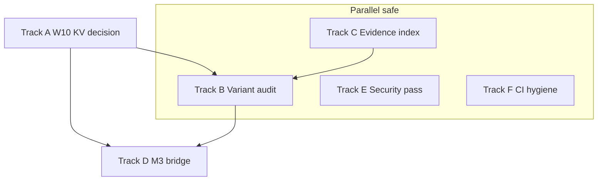

# Master follow-through program — post–Memory v2 wiring

This document is the **umbrella program** for everything that should happen *after* the current wave of W7–W16 wiring, honest W10 KV probing, planner/bridge fixes, and plan–code alignment. It is intentionally **larger than a single PR or sprint**: treat it as a **portfolio** of tracks that can run in parallel where dependencies allow.

**How to use it**

1. **Pick a track** (or assign one per maintainer / agent fleet).
2. For each track, execute **phases in order**; each phase ends with an explicit **proof row** (command + pass criterion).
3. **Ship in slices**: one concern per PR; update this doc’s status tables when a slice lands.

**Global proof bar (every slice)**

| Gate | Command / artifact | Pass |
|------|----------------------|------|
| G0 | `cmake --build build` (dev preset) | Zero errors, `-Werror` clean on touched TUs |
| G1 | `./build/human_tests` | 0 failures, 0 ASan leaks |
| G2 | `bash scripts/check-memory-v2-header-collision.sh` | Pass (when memory headers touched) |
| G3 | `bash scripts/verify-all.sh` | All segments green before release-week merges |
| G4 | Release slice only: `cmake --preset release && cmake --build --preset release` + size note in PR | Within binary budget in `AGENTS.md` / roadmap |

---

## Program overview

| Track | Theme | Primary outcome | Depends on |
|-------|--------|-----------------|-------------|
| **A** | W10 KV — real reuse or explicit defer | Measurable latency/cost win **or** zero ambiguity in product/docs | W7 facade stable |
| **B** | `hu_memory_query_t.variant` audit | No silent mis-routing via zeroed queries | Track A schema clarity for KV paths |
| **C** | Evidence index + plan hygiene | Every W exit maps to tests/CI; drift visible in one place | None |
| **D** | M3 — frontier learner bridge | Chat path can load **one** proven adapter checkpoint (fixture-first) | W13 / ML CMake, provider surface |
| **E** | Security / gateway / tools pass | Threat-aligned review + tests on changed surfaces | None (parallel) |
| **F** | CI & verification automation | Baseline drift impossible to miss; `verify-all` reliable | None |

**Suggested calendar (wall-clock order is not strict; dependencies matter)**

```text
Week 0–1   Track C (index skeleton) + Track B (grep inventory) start in parallel
Week 1–2   Track B completion + Track A decision (defer vs implement)
Week 2–4   Track A implementation (if chosen) OR Track A “defer locked” + docs
Week 2–6   Track D (spikes → one vertical slice)
Ongoing    Track E (time-boxed passes per subdirectory)
Continuous Track F (after every merge that touches tests or presets)
```

---

## Track A — W10 neural KV: complete the contract

**Problem statement.** Today the agent may **probe** `neural_kv_cache` and persist **prompt token metadata** after a successful provider call, but there is **no provider short-circuit** unless `blob` carries a replayable payload and the provider stack knows how to apply it.

### Phase A0 — Decision (1 decision record, ≤ 1 page)

| Option | When to choose | Exit |
|--------|----------------|------|
| **A0a — Implement reuse** | You want measurable **TTFT / cost** wins this quarter | ADR: blob format + provider hook + rollback flag |
| **A0b — Explicit defer** | Replay semantics differ per provider; risk > reward now | ADR: “metadata only until vX”; config/docs/UI strings updated |

**Deliverable:** `docs/plans/adr/` or a subsection in [`2026-05-10-w10-neural-memory.md`](2026-05-10-w10-neural-memory.md) titled **KV replay decision**.

### Phase A1 — If A0a (implement reuse)

| Step | Work | Proof |
|------|------|--------|
| A1.1 | Define **versioned blob envelope** (magic, version, codec id, payload). Document endianness and max size. | Doc + `tests/test_w10_neural_memory.c` round-trip |
| A1.2 | On **cache hit**, construct minimal `hu_chat_response_t` (or stream synthesis) from blob **only** when `HU_KV_CACHE_REPLAY=1` (name TBD) and model id matches | Integration test with mock provider |
| A1.3 | On miss, **put** full blob after provider success; maintain **invalidation** on model version bump | Tests + `hu_kv_cache_invalidate_for_model` call site |
| A1.4 | **Privacy / safety**: never cache system prompts that contain secrets; optional contact-scoped hash salt | Red-team test + doc |

### Phase A2 — If A0b (defer)

| Step | Work | Proof |
|------|------|--------|
| A2.1 | Rename log lines / metrics to “**kv_metadata**” not “hit” where misleading | Grep clean in `src/agent/agent_turn.c` |
| A2.2 | Default **off** in user-facing docs; CLI `human` help text if any KV wording exists | `doc-fleet` |
| A2.3 | Link from [`include/human/memory/neural_memory.h`](../../include/human/memory/neural_memory.h) to ADR | Link check |

---

## Track B — `hu_memory_query_t.variant` completeness audit

**Goal:** Every `hu_memory_facade_read` / facade-bound query construction site sets **`variant`** explicitly so behavior does not depend on union initialization accidents.

### Phase B0 — Inventory

| Step | Work | Proof |
|------|------|--------|
| B0.1 | Script or documented `rg` recipe: find `memset(&*q*, 0` / `memset(&rq` then `\.kind\s*=` without nearby `variant` | Paste output into Track C index appendix |
| B0.2 | Classify each hit: **safe**, **fix**, **delete dead** | Spreadsheet or table in repo |

### Phase B1 — Fix in slices (suggested grouping)

| Slice | Paths | Proof |
|-------|-------|--------|
| B1.a | `src/agent/*.c` (turn, stream, planners, verifiers) | `./build/human_tests --suite=W12` + targeted filters |
| B1.b | `src/memory/*.c` (export, neural, v1 backend) | `test_w7_memory_facade` + `test_w10_*` |
| B1.c | `src/persona/`, `src/feeds/`, `src/channels/` touchpoints | Suite mapping via `scripts/what-to-test.sh` |

### Phase B2 — Prevent regression

| Step | Work | Proof |
|------|------|--------|
| B2.1 | Optional **clang-tidy** or custom script: flag new `hu_memory_query_t` literals without `variant` | CI job (optional, non-blocking first) |
| B2.2 | Add **one** “negative” test that would have failed under old zero-init assumption | Test name documented in Track C index |

---

## Track C — Memory v2 evidence index & documentation hygiene

**Goal:** A single **source of truth** linking roadmap exit criteria → **tests** → **CI/workflow** → **headers**.

### Phase C0 — Create the index file

**Created:** [`2026-05-10-memory-v2-evidence-index.md`](2026-05-10-memory-v2-evidence-index.md) (workstream table, CI entrypoints, CMake flags, ADR links, Track B appendix).

**Ongoing:** extend rows when new suites land; keep “Known mismatches” honest.

### Phase C1 — Keep parent plans honest

| Step | Work | Proof |
|------|------|--------|
| C1.1 | On each merged track, update **status** / “As-built” rows in [`2026-05-10-memory-v2-execution-plan.md`](2026-05-10-memory-v2-execution-plan.md) | PR checklist |
| C1.2 | Quarterly: diff overview success metrics vs measured numbers | Link to `docs/evaluation/` or W16 baselines |

---

## Track D — M3 private learning: frontier model bridge (vertical slice)

**North star (from `CLAUDE.md`).** LoRA / checkpoints must attach to the **model the user actually chats with**, not only the reference HUML GPT.

### Phase D0 — Spike (time-boxed)

| Step | Work | Proof |
|------|------|--------|
| D0.1 | Read **M3** scope in [`CLAUDE.md`](../../CLAUDE.md) mission table; if no dedicated bridge spec exists yet, author `docs/plans/2026-05-10-m3-frontier-model-bridge.md` from that text | Spec or `CLAUDE.md` cite in PR |
| D0.2 | Pick **one** backend (ggml **or** MLX **or** embedded) for first vertical slice | ADR: backend choice + non-goals |
| D0.3 | Prove **load + noop inference** in `HU_IS_TEST` with fixture weights (no network) | New test + CI |

### Phase D1 — Training → inference loop (minimal)

| Step | Work | Proof |
|------|------|--------|
| D1.1 | CLI or config: **path to adapter** + **model id binding** | Config parse tests |
| D1.2 | Provider: when adapter present, call bridge hook; when absent, unchanged | Provider unit tests |
| D1.3 | **Rollback**: disable flag removes hook entirely | Binary size note in PR |

### Phase D2 — Product truth

| Step | Work | Proof |
|------|------|--------|
| D2.1 | Update user-facing caveat strings in `human ml` output | Snapshot or golden test |
| D2.2 | A/B or offline eval **optional**; document “not yet” if not done | W16 eval doc link |

---

## Track E — Security, gateway, tools, runtime (tiered review)

Per `AGENTS.md` **risk tiers**, this track is **high depth**, **time-boxed per directory**.

### Phase E0 — Scope and checklist

| Area | Path | Checklist source |
|------|------|------------------|
| Gateway | `src/gateway/gateway.c` + HTTP helpers | `docs/standards/security/` |
| Tools | `src/tools/` (shell, file, browser, …) | Threat model + sandbox docs |
| Runtime | `src/runtime/` | Process spawn, cwd, env |
| Secrets | `src/security/` | Keystore, audit, no secret logs |

### Phase E1 — Per-package milestones

| Milestone | Work | Proof |
|-----------|------|--------|
| E1.1 | **Static pass**: grep for `system(`, `popen`, `getenv` in sensitive paths; justify or remove | PR notes |
| E1.2 | **Dynamic pass**: extend fuzz or add harness for one parser surface | OSS-Fuzz / local fuzz job |
| E1.3 | **UI / demo gateway** parity if C API changes | `ui/src/demo-gateway.ts` per `AGENTS.md` |

---

## Track F — CI, presets, and “verify-all” reliability

### Phase F0 — Baseline policy

| Rule | Implementation |
|------|------------------|
| Test count | After any PR that adds/removes `HU_RUN_TEST`, update `.github/workflows/ci.yml` `BASELINE` |
| Preset drift | Document: **always** `cmake --preset dev -B build` after `make clean` or machine switch |

### Phase F1 — Harden `verify-all`

| Step | Work | Proof |
|------|------|--------|
| F1.1 | Capture **first failing line** to a log artifact in CI (optional) | Easier triage |
| F1.2 | If C build fails, **skip** C tests in script OR mark “skipped because build failed” | No false “tests failed” when compile broke |

### Phase F2 — Weekly ceremony

| Ceremony | Cadence | Owner |
|----------|---------|-------|
| Full `verify-all.sh` | Weekly | Maintainer on rotation |
| Doc fleet | Same as `docs/standards/quality/ceremonies.md` | Automated in hooks where possible |

---

## Dependency diagram (high level)



Interpretation: **Track C** helps **Track B** (documentation of what “correct” means). **Track A** decision constrains whether **Track D** must coordinate KV invalidation with adapter versions. **Track E** and **F** run continuously.

---

## Risk register (rolled up)

| Risk | Likelihood | Impact | Mitigation |
|------|------------|--------|------------|
| KV replay introduces **wrong-answer** cache | Med | Catastrophic | Feature flag default OFF; conservative TTL; abstain on parse error |
| Variant audit is **large** and stalls other work | Med | Med | Slice by directory; don’t boil ocean in one PR |
| M3 bridge slips **half-implemented** | High | High | ADR + “honest mode” strings + tests that fail if hook missing |
| Security review becomes **theater** | Med | High | Time-box + checklist + one new test per finding class |
| `verify-all` flakes obscure real failures | Med | Med | Track F1 |

---

## Status table (edit in place as work lands)

| Track | Phase | Status | Last proof (link or commit) |
|-------|-------|--------|----------------------------|
| A | A0 | `done` | ADR [`adr/2026-05-10-w10-kv-replay-deferred.md`](adr/2026-05-10-w10-kv-replay-deferred.md) — replay deferred |
| A | A2.1–A2.3 | `done` | `agent_turn.c` log lines say `"W10 KV prior row (no provider skip)"` (no misleading hit naming); `include/human/memory/neural_memory.h:13` links to ADR; no user-facing CLI strings claim KV replay |
| B | B0–B2 | `done` | B2: `scripts/check-memory-query-variant.sh` + verify-all + agent-preflight; suite 9771/9771 (CI `BASELINE` in `ci.yml`) |
| C | C0 | `done` | Evidence index file (same commit family) |
| D | D0.3–D1.1 | `in_progress` | Stub API + `personalization.m3_adapter_probe_path` (parse/serialize + daemon probe when `HU_ENABLE_ML`); tests in `test_ml.c` + `test_config_parse.c` |
| E | E0 | `in_progress` | `scripts/security-sensitive-api-scan.sh` (+ optional `VERIFY_SECURITY_SCAN=1` in verify-all) |
| F | F0–F1.2 | `done` | verify-all skips C tests when C build fails; doc tip for `tee` log |

---

## Appendix A — Quick `rg` recipes (Track B)

```bash
# Candidate hu_memory_query_t zero-init sites (manual review required)
rg -n 'memset\s*\(\s*&[a-zA-Z_][a-zA-Z0-9_]*\s*,\s*0\s*,\s*sizeof\s*\(\s*hu_memory_query_t' src/

# hu_memory_query_t stack declarations
rg -n 'hu_memory_query_t\s+[a-zA-Z_]+' src/ | head -200
```

---

## Appendix B — Related repository law

- Engineering protocol: [`AGENTS.md`](../../AGENTS.md)
- Memory v2 overview: [`2026-05-10-memory-v2-roadmap-overview.md`](2026-05-10-memory-v2-roadmap-overview.md)
- Sequenced execution: [`2026-05-10-memory-v2-execution-plan.md`](2026-05-10-memory-v2-execution-plan.md)
- W10 spec: [`2026-05-10-w10-neural-memory.md`](2026-05-10-w10-neural-memory.md)

---

## Approval

This program does **not** require a single “big bang” approval. **Track A0** (KV decision) and **Track D0** (M3 spike scope) should each get a **one-page ADR** before large code dumps. Everything else can proceed under normal PR review with the global proof bar.
